Image Classification

                                                                        May
31, 2016

Students: Tao Ren @ Queens College

Professor: Chao Chen

Problem {#h.mljvl1myqxb3 .c47}
=======

Our project is Image Classification and the problem we have for this
project is that Machines does not recognize things in the picture. For
example, if you give mechine a picture and inside the picture is a dog,
how can machines know there is a dog in the picture?  

Goal {#h.sspx41ab79z3 .c47}
====

The goal for our project is that Feed 50,000 images to training set and
use 10,000 to test. And use three different methods to test the
accuracy.

DataSet {#h.e7tmd692pxje .c47 .c27}
=======

        The DataSet we use is CIFAR-10. CIFAR-10 is a subset of the 80
million tiny images dataset and consists of 60,000 32 \* 32 color images
containing one of 10 object classes, with 6000 images per class.

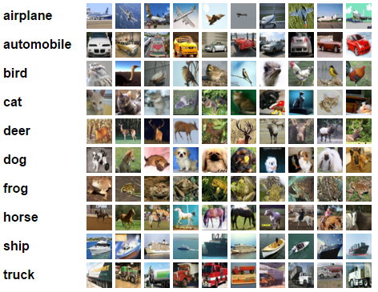

Figure 1: The catalog of CIFAR-10, images are from
[http://www.cs.toronto.edu/\~kriz/cifar.html](https://www.google.com/url?q=http://www.cs.toronto.edu/~kriz/cifar.html&sa=D&ust=1500874760910000&usg=AFQjCNHhOeuk2q39HJ4HYn0ZyP3_lkBQOw) website.

* * * * *

 {#h.f33lucvs9sza .c40}

Fractional Max-Pooling with CNN {#h.j3epc0ve3yds .c47}
===============================

Overview {#h.so4mv8pw130m .c29}
--------

Convolutional networks almost always incorporate some form of spatial
pooling, and very often it is    max-pooling with  = 2. Max-pooling act
on the hidden layers of the network, reducing their size by an integer
multiplicative factor . The amazing by-product of discarding 75% of

your data is that you build into the network a degree of invariance with
respect to translations and elastic distortions. However, if you simply
alternate convolutional layers with max-pooling layers, performance is
limited due to the rapid reduction in spatial size, and the disjoint
nature

of the pooling regions. A fractional version of max-pooling where  is
allowed to take non-integer values. Our version of max-pooling is
stochastic as there are lots of different ways of constructing suitable
pooling regions.

Convolutional Neural Networks Architecture {#h.1xozi13l9qrg .c12}
------------------------------------------

Compared to regular Neural Network, Convolutional Neural Networks take
advantage of the fact that the input consists of images and they
constrain the architecture in a more sensible way. In particular, unlike
a regular Neural Network, the layers of a ConvNet have neurons arranged
in 3 dimensions: width, height, depth. (Note that the word depth here
refers to the third dimension of an activation volume, not to the depth
of a full Neural Network, which can refer to the total number of layers
in a network.) The input images in CIFAR-10 are an input volume of
activations, and the volume has dimensions 32x32x3 (width, height, depth
respectively). As we will soon see, the neurons in a layer will only be
connected to a small region of the layer before it, instead of all of
the neurons in a fully-connected manner. Moreover, the final output
layer would for CIFAR-10 have dimensions 1x1x10, because by the end of
the ConvNet architecture we will reduce the full image into a single
vector of class scores, arranged along the depth dimension. Here is a
visualization:

Layers used to build ConvNets {#h.r4la02bbbvge .c12}
-----------------------------

As we described above, a simple ConvNet is a sequence of layers, and
every layer of a ConvNet transforms one volume of activations to another
through a differentiable function. We use three main types of layers to
build ConvNet architectures: Convolutional Layer, Pooling Layer, and
Fully-Connected Layer (exactly as seen in regular Neural Networks). We
will stack these layers to form a full ConvNet architecture.

Example Architecture: Overview. We will go into more details below, but
a simple ConvNet for CIFAR-10 classification could have the architecture
[INPUT - CONV - RELU - POOL - FC]. In more detail:

-   INPUT [32x32x3] will hold the raw pixel values of the image, in this
    case an image of width 32, height 32, and with three color channels
    R,G,B.
-   CONV layer will compute the output of neurons that are connected to
    local regions in the input, each computing a dot product between
    their weights and a small region they are connected to in the input
    volume. This may result in volume such as [32x32x12] if we decided
    to use 12 filters.
-   RELU layer will apply an elementwise activation function, such as
    the max(0,x) thresholding at zero. This leaves the size of the
    volume unchanged ([32x32x12]).
-   POOL layer will perform a downsampling operation along the spatial
    dimensions (width, height), resulting in volume such as [16x16x12].
-   FC (i.e. fully-connected) layer will compute the class scores,
    resulting in volume of size [1x1x10], where each of the 10 numbers
    correspond to a class score, such as among the 10 categories of
    CIFAR-10. As with ordinary Neural Networks and as the name implies,
    each neuron in this layer will be connected to all the numbers in
    the previous volume.

In this way, ConvNets transform the original image layer by layer from
the original pixel values to the final class scores. Note that some
layers contain parameters and other don’t. In particular, the CONV/FC
layers perform transformations that are a function of not only the
activations in the input volume, but also of the parameters (the weights
and biases of the neurons). On the other hand, the RELU/POOL layers will
implement a fixed function. The parameters in the CONV/FC layers will be
trained with gradient descent so that the class scores that the ConvNet
computes are consistent with the labels in the training set for each
image.

Convolutional Layer {#h.rkne6163k4oi .c12}
-------------------

The Conv layer is the core building block of a Convolutional Network
that does most of the computational heavy lifting.

Overview. The CONV layer’s parameters consist of a set of learnable
filters. Every filter is small spatially (along width and height), but
extends through the full depth of the input volume. For example, a
typical filter on a first layer of a ConvNet might have size 5x5x3 (i.e.
5 pixels width and height, and 3 because images have depth 3, the color
channels). During the forward pass, we slide (more precisely, convolve)
each filter across the width and height of the input volume and compute
dot products between the entries of the filter and the input at any
position. As we slide the filter over the width and height of the input
volume we will produce a 2-dimensional activation map that gives the
responses of that filter at every spatial position. Intuitively, the
network will learn filters that activate when they see some type of
visual feature such as an edge of some orientation or a blotch of some
color on the first layer, or eventually entire honeycomb or wheel-like
patterns on higher layers of the network. Now, we will have an entire
set of filters in each CONV layer (e.g. 12 filters), and each of them
will produce a separate 2-dimensional activation map. We will stack
these activation maps along the depth dimension and produce the output
volume.

Local Connectivity. When dealing with high-dimensional inputs such as
images, as we saw above it is impractical to connect neurons to all
neurons in the previous volume. Instead, we will connect each neuron to
only a local region of the input volume. The spatial extent of this
connectivity is a hyperparameter called the receptive field of the
neuron (equivalently this is the filter size). The extent of the
connectivity along the depth axis is always equal to the depth of the
input volume. It is important to emphasize again this asymmetry in how
we treat the spatial dimensions (width and height) and the depth
dimension: The connections are local in space (along width and height),
but always full along the entire depth of the input volume.

Spatial arrangement. We have explained the connectivity of each neuron
in the Conv Layer to the input volume, but we haven’t yet discussed how
many neurons there are in the output volume or how they are arranged.
Three hyperparameters control the size of the output volume: the depth,
stride and zero-padding.

1.  First, the depth of the output volume is a hyperparameter: it
    corresponds to the number of filters we would like to use, each
    learning to look for something different in the input. For example,
    if the first Convolutional Layer takes as input the raw image, then
    different neurons along the depth dimension may activate in presence
    of various oriented edged, or blobs of color. We will refer to a set
    of neurons that are all looking at the same region of the input as a
    depth column (some people also prefer the term fibre).
2.  Second, we must specify the stride with which we slide the filter.
    When the stride is 1 then we move the filters one pixel at a time.
    When the stride is 2 (or uncommonly 3 or more, though this is rare
    in practice) then the filters jump 2 pixels at a time as we slide
    them around. This will produce smaller output volumes spatially.
3.  As we will soon see, sometimes it will be convenient to pad the
    input volume with zeros around the border. The size of this
    zero-padding is a hyperparameter. The nice feature of zero padding
    is that it will allow us to control the spatial size of the output
    volumes (most commonly as we’ll see soon we will use it to exactly
    preserve the spatial size of the input volume so the input and
    output width and height are the same).

We can compute the spatial size of the output volume as a function of
the input volume size (W), the receptive field size of the Conv Layer
neurons (F), the stride with which they are applied (SS), and the amount
of zero padding used (P) on the border. You can convince yourself that
the correct formula for calculating how many neurons “fit” is given by
(W−F+2P)/S+1(W−F+2P)/S+1. For example for a 7x7 input and a 3x3 filter
with stride 1 and pad 0 we would get a 5x5 output. With stride 2 we
would get a 3x3 output.

Implementation as Matrix Multiplication. Note that the convolution
operation essentially performs dot products between the filters and
local regions of the input. A common implementation pattern of the CONV
layer is to take advantage of this fact and formulate the forward pass
of a convolutional layer as one big matrix multiply as follows:

1.  The local regions in the input image are stretched out into columns
    in an operation commonly called im2col. For example, if the input is
    [227x227x3] and it is to be convolved with 11x11x3 filters at stride
    4, then we would take [11x11x3] blocks of pixels in the input and
    stretch each block into a column vector of size 11\*11\*3 = 363.
    Iterating this process in the input at stride of 4 gives
    (227-11)/4+1 = 55 locations along both width and height, leading to
    an output matrix X\_col of im2col of size [363 x 3025], where every
    column is a stretched out receptive field and there are 55\*55 =
    3025 of them in total. Note that since the receptive fields overlap,
    every number in the input volume may be duplicated in multiple
    distinct columns.
2.  The weights of the CONV layer are similarly stretched out into rows.
    For example, if there are 96 filters of size [11x11x3] this would
    give a matrix W\_row of size [96 x 363].
3.  The result of a convolution is now equivalent to performing one
    large matrix multiply np.dot(W\_row, X\_col), which evaluates the
    dot product between every filter and every receptive field location.
    In our example, the output of this operation would be [96 x 3025],
    giving the output of the dot product of each filter at each
    location.
4.  The result must finally be reshaped back to its proper output
    dimension [55x55x96].

This approach has the downside that it can use a lot of memory, since
some values in the input volume are replicated multiple times in X\_col.
However, the benefit is that there are many very efficient
implementations of Matrix Multiplication that we can take advantage of.

Backpropagation. The backward pass for a convolution operation (for both
the data and the weights) is also a convolution (but with
spatially-flipped filters).

 {#h.q0abj4kpl66o .c29 .c43}

 {#h.z5w1kt4gjmfk .c12 .c43}

Network-in-Network Layer {#h.apckbhcd1myp .c12}
------------------------

An NiN layer is a convolutional layer where the filters have
spatial size just 1 x 1. They can be thought of as single layer networks
that increase the learning power of a convolutional layer without
changing the spatial structure. We placed NiN layers after each
max-pooling layer and the final convolutional layer.

 {#h.yqoq7yizwyrd .c12 .c43}

Activation function {#h.gn7l0ji5vbvt .c12}
-------------------

Leaky ReLU. Leaky ReLUs are one attempt to fix the “dying ReLU” problem.
Instead of the function being zero when x \< 0, a leaky ReLU will
instead have a small negative slope (of 0.33). That is, the function
computes f(x)=𝟙(x\<0)(αx)+𝟙(x\>=0)(x) where α is ⅓.

Softmax classifier {#h.2jciucltt59n .c12}
------------------

It turns out that the SVM is one of two commonly seen classifiers. The
other popular choice is the Softmax classifier, which has a different
loss function. If you’ve heard of the binary Logistic Regression
classifier before, the Softmax classifier is its generalization to
multiple classes. Unlike the SVM which treats the outputs f(xi,W) as
(uncalibrated and possibly difficult to interpret) scores for each
class, the Softmax classifier gives a slightly more intuitive output
(normalized class probabilities) and also has a probabilistic
interpretation that we will describe shortly. In the Softmax classifier,
the function mapping f(xi;W)=Wxi stays unchanged, but we now interpret
these scores as the unnormalized log probabilities for each class and
replace the hinge loss with a cross-entropy loss that has the form:

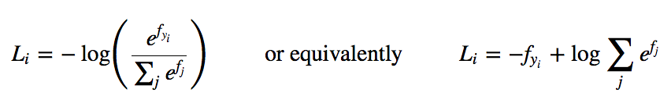

where we are using the notation fj to mean the j-th element of the
vector of class scores f. As before, the full loss for the dataset is
the mean of Li over all training examples together with a regularization
term R(W). The function fj(z)=ezj/∑kezk is called the softmax function:
It takes a vector of arbitrary real-valued scores (in z) and squashes it
to a vector of values between zero and one that sum to one. The full
cross-entropy loss that involves the softmax function might look scary
if you’re seeing it for the first time but it is relatively easy to
motivate.

Information theory view. The cross-entropy between a “true” distribution
p and an estimated distribution qq is defined as:

H(p,q)=−∑xp(x)log⁡q(x)

The Softmax classifier is hence minimizing the cross-entropy between the
estimated class probabilities ( q=efyi/∑jefj as seen above) and the
“true” distribution, which in this interpretation is the distribution
where all probability mass is on the correct class (i.e.
p=[0,…1,…,0] contains a single 1 at the yi-th position.).

We can use the cross-entropy loss to train the convolutional neural
network.

Spatial sparsity for convolutional networks {#h.ezy30vb9ql5i .c12}
-------------------------------------------

Imagine putting an all-zero array into the input layer of a CNN. As you
evaluate the network in the forward direction, the translational
invariance of the input is propagated to each of the hidden layers in
turn. We can therefore think of each hidden variable as having a ground
state corresponding to receiving no meaningful input; the ground state
is generally non-zero because of bias terms. When the input array is
sparse, you only have to calculate the values of the hidden variables
where they differ from their ground state. Figure S1 shows how the
active spatial locations change through the layers.

Figure S1: The active spatial locations (black) when a circle with
diameter 32 is placed in the center of a 94 × 94 input layer and fed
forward. Sparsity is most important in the early stages where most of
the spatial locations are in their ground state (gray).

Essentially, we want to memoize the convolutional and pooling
operations. Memoizing can be done using a hash table, but that would be
inefficient here as for each operation there is only one input,
corresponding to regions in the ground state, that we expect to see
repeatedly.

Instead, to forward propagate the network we calculate two matrices for
each layer of the network:

-   A feature matrix which is a list of row vectors, one for the ground
    state, and one for each active spatial location in the layer; the
    width of the matrix is the number of features per spatial location.
-   A pointer matrix with size equal to the spatial size of the
    convolutional layer. For each spatial location in the convolutional
    layer, we store the number of the corresponding row in the feature
    matrix.

This representation is very loosely biologically inspired. The human
visual cortex separates into two streams of information: the dorsal
(where) and ventral (what) streams. Similar data structures can be used
in reverse order for backpropagation.

For a regular convolutional network, the convolutional and pooling
operations within a layer can be performed in parallel on a GPU (or even
spread over multiple GPUs). Exactly the same holds here; there is simply
less work to do as we know the inactive output spatial locations are all
the same.

Dropout {#h.1hf6i3ojgfn5 .c29}
-------

Model combination nearly always improves the performance of machine
learning methods. With large neural networks, however, the obvious idea
of averaging the outputs of many separately trained nets is
prohibitively expensive. Combining several models is most helpful when
the individual models are different from each other and in order to make
neural net models different, they should either have different
architectures or be trained on different data. Training many different
architectures is hard because finding optimal hyperparameters for each
architecture is a daunting task and training each large network requires
a lot of computation. Moreover, large networks normally require large
amounts of training data and there may not be enough data available to
train different networks on different subsets of the data. Even if one
was able to train many different large networks, using them all at test
time is infeasible in applications where it is important to respond
quickly.

Figure D1

Dropout is a technique that addresses both these issues. It prevents
overfitting and provides a way of approximately combining exponentially
many different neural network architectures efficiently. The term
“dropout” refers to dropping out units (hidden and visible) in a neural
network. By dropping a unit out, we mean temporarily removing it from
the network, along with all its incoming and outgoing connections, as
shown in Figure D1. The choice of which units to drop is random. In the
simplest case, each unit is retained with a fixed probability p
independent of other units, where p can be chosen using a validation set
or can simply be set at 0.5, which seems to be close to optimal for a
wide range of networks and tasks. For the input units, however, the
optimal probability of retention is usually closer to 1 than to 0.5.

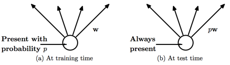Figure D2

Applying dropout to a neural network amounts to sampling a “thinned”
network from it. The thinned network consists of all the units that
survived dropout (Figure D1.b). A neural net with n units, can be seen
as a collection of 2n possible thinned neural networks. These networks
all share weights so that the total number of parameters is still O(n2),
or less. For each presentation of each training case, a new thinned
network is sampled and trained. So training a neural network with
dropout can be seen as training a collection of 2n thinned networks with
extensive weight sharing, where each thinned network gets trained very
rarely, if at all.

At test time, it is not feasible to explicitly average the predictions
from exponentially many thinned models. However, a very simple
approximate averaging method works well in practice. The idea is to use
a single neural net at test time without dropout. The weights of this
network are scaled-down versions of the trained weights. If a unit is
retained with probability p during training, the outgoing weights of
that unit are multiplied by p at test time as shown in Figure D2. This
ensures that for any hidden unit the expected output (under the
distribution used to drop units at training time) is the same as the
actual output at test time. By doing this scaling, 2n networks with
shared weights can be combined into a single neural network to be used
at test time. We found that training a network with dropout and using
this approximate averaging method at test time leads to significantly
lower generalization error on a wide variety of classification problems
compared to training with other regularization methods.

Consider a neural network with L hidden layers. Let
l{1,...,L} index the hidden layers of the network.
Let z(l) denote the vector of inputs into layer l, y(l) denote the
vector of outputs from layer l (y(0) = x is the input). W(l) and
b(l) are the weights and biases at layer l. The feed-forward operation
of a standard neural network can be described as (for
l{1,...,L} and any hidden unit i)

zi(l+1)  = wi(l+1) yl + bi(l+1) ,

yi(l+1)  = f(zi(l+1) ) ,

where f is the activation function, here is Leaky ReLU:

With dropout, the feed-forward operation becomes

rj(l)      \~ Bernoulli(p),

(l)    = r(l) \* y(l),

zi(l+1)  = wi(l+1)(l) + bi(l+1) ,

yi(l+1)  = f(zi(l+1) ) ,

Here \* denotes an element-wise product. For any layer l, r(l) is a
vector of independent Bernoulli random variables each of which has
probability p of being 1. This vector is sampled and multiplied
element-wise with the outputs of that layer, y(l), to create the thinned
outputs (l). The thinned outputs are then used as
input to the next layer. This process is applied at each layer. This
amounts to sampling a sub-network from a larger network. For learning,
the derivatives of the loss function are backpropagated through the
sub-network. At test time, the weights are scaled as Wtest(l)= pW(l).
The resulting neural network is used without dropout.

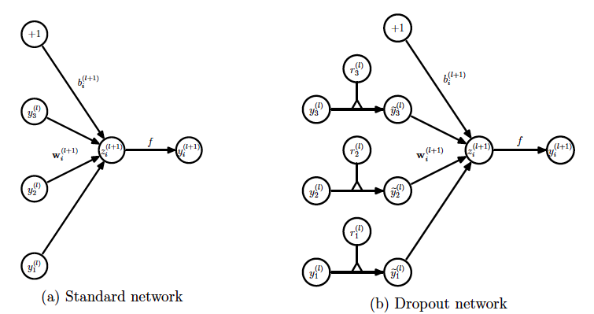

Fractional max-pooling (FMP) {#h.jd3ivq4n7mj2 .c12}
----------------------------

The idea of FMP is to reduce the spatial size of the image by a factor
of   with 1 \< α  \< 2 . Like stochastic pooling, FMP introduces a
degree of randomness to the pooling process. However,
unlike stochastic-pooling, the randomness is related to the choice of
pooling regions, not the way pooling is performed inside each of the
pooling regions. Briefly, there are three choices that affect the way
FMP is implemented:

-   The pooling fraction which determines the ratio between the
    spatial sizes of the input and the output of the pooling layer.
    Regular 2 x 2  max-pooling corresponds to the special case α = 2 .
-   The pooling regions can either be chosen in a random or a
    pseudorandom fashion. There seems to be a trade off between the use
    of randomness in FMP and the use of dropout and/or training data
    augmentation. Random-FMP seems to work better on its own; however,
    when combined with ‘too much’ dropout or training data
    augmentation, underfitting can occur.
-   The pooling regions can be either disjoint or overlapping. Disjoint
    regions are easier to picture, but we find that overlapping regions
    work better.

Each convolutional filter of a CNN produces a matrix of hidden
variables. The size of this matrix is often reduced using some form of
pooling. Max-pooling is a procedure that takes an Nin × Nin input matrix
and returns a smaller output matrix, say Nout × Nout. This is achieved
by dividing the Nin × Nin square into Nout2 pooling regions (Pi,j ):

Pi,j ⊂ {1, 2, . . . , Nin}2 for each (i, j) ∈ {1, . . . , Nout}2

and then setting

If we take Nin/Nout ≈then the rate of decay of
the spatial size of interesting features is n times slower. For clarity
we will now focus on the case Nin/Nout ∈ (1, 2) as we are
primarily interested in accuracy; if speed is an overbearing concern
then FMP could be applied with Nin/Nout ∈ (2, 3).

Given a particular pair of values (Nin, Nout) we need a way to choose
pooling regions (Pi,j ). We will consider two type of arrangements,
overlapping squares and disjoint collections of rectangles. In Figure F1
we show a number of different ways of dividing up a 36 × 36 square grid
into disjoint rectangles. Pictures two, three and six in Figure F1 can
also be used to define an arrangement of overlapping 2 × 2 squares: take
the top left hand corner of each rectangle in the picture to be the top
left hand corner of one of the squares.

Figure F1

To give a formal description of how to generate pooling regions, let
(ai)i=0Nout and (bi)i=0Nout be two increasing sequence of integers
starting at 1, ending with Nin, and with increments all equal to one or
two (i.e. ai+1 − ai ∈ {1, 2}). The regions can then be defined by either

P = [ai−1, ai − 1] × [bj−1, bj − 1] or Pi,j = [ai−1, ai] × [bj−1, bj].

We call the two cases disjoint and overlapping, respectively. We have
tried two different approaches for generating the integer sequence:
using random sequences of numbers and also using pseudorandom sequences.

We will say that the sequences are random if the increments are obtained
by taking a random permutation of an appropriate number of ones and
twos. We will say that the sequences are pseudorandom if they take the
form

ai = ceiling(α(i + u)), α ∈ (1, 2), with some u ∈ (0, 1).

Below are some patterns of increments corresponding to the case Nin =
25, Nout = 18. The increments on the left were generated ‘randomly’, and
the increments on the right come from pseudorandom sequences:

211112112211112122        112112121121211212

111222121121112121        212112121121121211

121122112111211212        211211212112121121

Although both types of sequences are irregular, the pseudorandom
sequences generate much more stable pooling regions than the random
ones. To show the effect of randomizing the pooling regions, see Figure
F2. We have taken a picture, and we have iteratively used disjoint
random pooling regions to reduce the size of the image (taking averages
in each pooling region). The result is that the scaled down images show
elastic distortion. In contrast, if we use pseudorandom pooling regions,
the resulting image is simply a faithfully scaled down version of the
original.

Figure F2: Top left, ‘Kodak True Color’ parrots at a resolution of 384 ×
256. The other five images are one-eighth of the resolution as a result
of 6 layers of average pooling using disjoint random
FMP-pooling regions.

RNG {#h.c8zb8ynsz4pf .c29}
---

Random number generator, which is used in this project for dropout and
fmp, has some functions:

-   uniform(a, b): Generates uniformly distributed integer random number
    from [a,b)
-   normal: Generates random numbers according to the Normal (or
    Gaussian) random number distribution:
-   bernoulli: Produces random boolean values, according to the discrete
    probability function: 
-   NchooseM: Generates the n choose m row randomization matrix/vector.
    If we want to do dropout, e.g. N input features needs to drop to M
    output features, NchooseM can generate M random unique index, which
    we can keep that related M features, and the remain features are
    dropped.
-   permutation: Generates a shuffled number sequence: {0,1,...,n-1}. If
    we want to generate a random pooling regions, we can create an
    integer array filled with appropriate number of ones and twos, using
    permutation to generate a shuffled index sequence, accordingly, a
    shuffled ones and twos.

Model {#h.56zxphngunmm .c29}
-----

Using a random overlapping pooling FMP network, there is a dropout layer
between every C2 and FMP layer.

C2: filterSize = 2

  std::cout \<\< "Convolution "

            \<\< filterSize \<\<"\^" \<\<dimension\<\< "x"\<\<
nFeaturesIn

            \<\< "-\>" \<\< nFeaturesOut;

F=2, S=1 W1=94, D1=3, P=0

W2 = 93, D2=12==\>32

ROFMPSparseConvNet::ROFMPSparseConvNet

addLeNetLayerROFMP() (SparseConvNetCUDA.cu)

→ addConvolutionalLayer()

push( ConvolutionalLayer )

        → addLearntLayer()

                push( NetworkInNetworkLayer )

→push( RandomOverlappingFractionalMaxPoolingLayer )

addLeNetLayerMP()

→ addConvolutionalLayer()

        → push( MaxPoolingLayer )

addLeNetLayerMP()

addSoftmaxLayer()

→ addLearntLayer()

Dimension: 2

l: 12 (i = 0; i \< l; i+)

k: 32

fmpShrik: 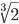

ActivationFunction: VLEAKRELU

Input Features: 3

Input Class: 10

dropout - p: 0.1

ConvolutionalLayer:

Features: k \* (i + 1)

filterSize: 2

filterStride: 1

poolSize: 2

fmpShrink: 

dropout: p \* i / (l + 1)

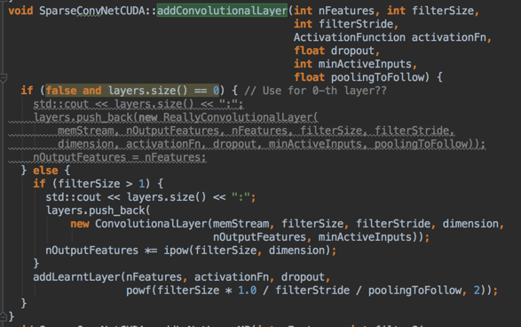

LearntLayer:

Features, activationFn, dropout,
(filterSize/filterStride/poolingToFollow)\^2

poolingToFollow==fmpShrink

NetworkInNetworkLayer

ROFMP:

poolsize, fmpShrink, dimension

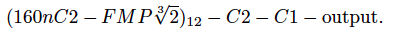

Layer sizes of the network:

[output]-1-(C1)-1-(C2)-2-(ROFMP)-3-(C2)-4-(ROFMP)-5-(C2)-6-(ROFMP)-8-(C2)-9-(ROFMP)-11-(C2)-12-(ROFMP)-15-(C2)-16-(ROFMP)-20-(C2)-21-(ROFMP)-26-(C2)-27-(ROFMP)-34-(C2)-35-(ROFMP)-44-(C2)-45-(ROFMP)-57-(C2)-58-(ROFMP)-73-(C2)-74-(ROFMP)-93-(C2)-94-[Input]

Using 50,000 pictures as training set, other remaining 10,000 pictures
as test set.

CNN Model to be trained:

(32nC2 - ROFMP)12 - C2 -C1 - output.

ROFMP: Pseudorandom Overlapping Fractional Maxing-out Pooling

+-----------+-----------+-----------+-----------+-----------+-----------+-----------+-----------+
| Layer ID  | Type      | Spatial   | Depth     | Filter    | Filter    | dropout   | fmpShrik  |
|           |           | Size      |           | Spatial   |           |           |           |
|           |           |           |           | Size      | Activatio |           |           |
|           |           |           |           |           | n         |           |           |
|           |           |           |           |           | Function  |           |           |
+-----------+-----------+-----------+-----------+-----------+-----------+-----------+-----------+
|           | Input     | 32x32     | 3         |           | Affine    |           |           |
|           |           |           |           |           | Transform |           |           |
+-----------+-----------+-----------+-----------+-----------+-----------+-----------+-----------+
| 0         | C2        | 94x94     | 12        | 2x2       |           |           |           |
+-----------+-----------+-----------+-----------+-----------+-----------+-----------+-----------+
| 1         | NiN       | 93x93     | 32        | 1x1       | LeakyReLU | 0.0       |           |
+-----------+-----------+-----------+-----------+-----------+-----------+-----------+-----------+
| 2         | ROFMP     | 93x93     | 32        | 1x1       |           |           |       |
+-----------+-----------+-----------+-----------+-----------+-----------+-----------+-----------+
| 3         | C2        | 74x74     | 128       | 2x2       |           |           |           |
+-----------+-----------+-----------+-----------+-----------+-----------+-----------+-----------+
| 4         | NiN       | 73x73     | 64        | 1x1       | LeakyReLU | 0.0       |           |
+-----------+-----------+-----------+-----------+-----------+-----------+-----------+-----------+
| 5         | ROFMP     | 73x73     | 64        | 1x1       |           |           |       |
+-----------+-----------+-----------+-----------+-----------+-----------+-----------+-----------+
| 6         | C2        | 58x58     | 256       | 2x2       |           |           |           |
+-----------+-----------+-----------+-----------+-----------+-----------+-----------+-----------+
| 7         | NiN       | 57x57     | 96        | 1x1       | LeakyReLU | 0.0       |           |
+-----------+-----------+-----------+-----------+-----------+-----------+-----------+-----------+
| 8         | ROFMP     | 57x57     | 96        | 1x1       |           |           |       |
+-----------+-----------+-----------+-----------+-----------+-----------+-----------+-----------+
| 9         | C2        | 45x45     | 384       | 2x2       |           |           |           |
+-----------+-----------+-----------+-----------+-----------+-----------+-----------+-----------+
| 10        | NiN       | 44x44     | 128       | 1x1       | LeakyReLU | 0.0       |           |
+-----------+-----------+-----------+-----------+-----------+-----------+-----------+-----------+
| 11        | ROFMP     | 44x44     | 128       | 1x1       |           |           |       |
+-----------+-----------+-----------+-----------+-----------+-----------+-----------+-----------+
| 12        | C2        | 35x35     | 512       | 2x2       |           |           |           |
+-----------+-----------+-----------+-----------+-----------+-----------+-----------+-----------+
| 13        | NiN       | 35x35     | 160       | 1x1       | LeakyReLU | 0.0       |           |
+-----------+-----------+-----------+-----------+-----------+-----------+-----------+-----------+
| 14        | ROFMP     | 34x34     | 160       | 1x1       |           |           |       |
+-----------+-----------+-----------+-----------+-----------+-----------+-----------+-----------+
| 15        | C2        | 27x27     | 640       | 2x2       |           |           |           |
+-----------+-----------+-----------+-----------+-----------+-----------+-----------+-----------+
| 16        | NiN       | 26x26     | 192       | 1x1       | LeakyReLU | 0.0       |           |
+-----------+-----------+-----------+-----------+-----------+-----------+-----------+-----------+
| 17        | ROFMP     | 26x26     | 192       | 1x1       |           |           |       |
+-----------+-----------+-----------+-----------+-----------+-----------+-----------+-----------+
| 18        | C2        | 21x21     | 768       | 2x2       |           |           |           |
+-----------+-----------+-----------+-----------+-----------+-----------+-----------+-----------+
| 19        | NiN       | 20x20     | 224       | 1x1       | LeakyReLU | 0.0       |           |
+-----------+-----------+-----------+-----------+-----------+-----------+-----------+-----------+
| 20        | ROFMP     | 20x20     | 224       | 1x1       |           |           |       |
+-----------+-----------+-----------+-----------+-----------+-----------+-----------+-----------+
| 21        | C2        | 16x16     | 896       | 2x2       |           |           |           |
+-----------+-----------+-----------+-----------+-----------+-----------+-----------+-----------+
| 22        | NiN       | 15x15     | 256       | 1x1       | LeakyReLU | 0.0       |           |
+-----------+-----------+-----------+-----------+-----------+-----------+-----------+-----------+
| 23        | ROFMP     | 15x15     | 256       | 1x1       |           |           |       |
+-----------+-----------+-----------+-----------+-----------+-----------+-----------+-----------+
| 24        | C2        | 12x12     | 1024      | 2x2       |           |           |           |
+-----------+-----------+-----------+-----------+-----------+-----------+-----------+-----------+
| 25        | NiN       | 11x11     | 288       | 1x1       | LeakyReLU | 0.111076  |           |
+-----------+-----------+-----------+-----------+-----------+-----------+-----------+-----------+
| 26        | ROFMP     | 11x11     | 288       | 1x1       |           |           |       |
+-----------+-----------+-----------+-----------+-----------+-----------+-----------+-----------+
| 27        | C2        | 9x9       | 1152      | 2x2       |           |           |           |
+-----------+-----------+-----------+-----------+-----------+-----------+-----------+-----------+
| 28        | NiN       | 8x8       | 320       | 1x1       | LeakyReLU | 0.0999687 |           |
+-----------+-----------+-----------+-----------+-----------+-----------+-----------+-----------+
| 29        | ROFMP     | 8x8       | 320       | 1x1       |           |           |       |
+-----------+-----------+-----------+-----------+-----------+-----------+-----------+-----------+
| 30        | C2        | 6x6       | 1280      | 2x2       |           |           |           |
+-----------+-----------+-----------+-----------+-----------+-----------+-----------+-----------+
| 31        | NiN       | 5x5       | 352       | 1x1       | LeakyReLU | 0.0908806 |           |
+-----------+-----------+-----------+-----------+-----------+-----------+-----------+-----------+
| 32        | ROFMP     | 5x5       | 352       | 1x1       |           |           |       |
+-----------+-----------+-----------+-----------+-----------+-----------+-----------+-----------+
| 33        | C2        | 4x4       | 1408      | 2x2       |           |           |           |
+-----------+-----------+-----------+-----------+-----------+-----------+-----------+-----------+
| 34        | NiN       | 3x3       | 384       | 1x1       | LeakyReLU | 0.0833073 |           |
+-----------+-----------+-----------+-----------+-----------+-----------+-----------+-----------+
| 35        | ROFMP     | 3x3       | 384       | 1x1       |           |           |       |
+-----------+-----------+-----------+-----------+-----------+-----------+-----------+-----------+
| 36        | C2        | 2x2       | 1536      | 2x2       |           |           |           |
+-----------+-----------+-----------+-----------+-----------+-----------+-----------+-----------+
| 37        | NiN       | 1x1       | 416       | 1x1       | LeakyReLU | 0.076899  |           |
+-----------+-----------+-----------+-----------+-----------+-----------+-----------+-----------+
| 38        | NiN       | 1x1       | 448       | 1x1       | LeakyReLU | 0.0714062 |           |
+-----------+-----------+-----------+-----------+-----------+-----------+-----------+-----------+
| 39        | FC        | 1x1       | 10        |           | Softmax   |           |           |
+-----------+-----------+-----------+-----------+-----------+-----------+-----------+-----------+
|           | Output    |           |           |           |           |           |           |
+-----------+-----------+-----------+-----------+-----------+-----------+-----------+-----------+

Extra Dataset into Spatially Sparse Dataset {#h.3bhji4xb5m1g .c29}
-------------------------------------------

The SparseConvNet project that we are using read dataset directly from
bin format into Spatially Sparse Dataset which combine 3 separated
channel data into one pixel.

According to  the CNN Model: (32nC2 - ROFMP)12 -
C2 -C1 - output, we can calculate that the training input data’s spatial
size should be 94x94. The actual input picture’s size is 32x32, which
will place at the center of a 94x94 sparse grid after the
augmentation(see below).

 

Training Data Augmentation {#h.jpnt0km8r9zx .c12}
--------------------------

We extended the training set using affine transformations: a randomized
mix of scaling, reflections, shearing, rotations, and translation
operations. We also added random shifts to the pictures in RGB
colorspace.

W-scale: 0.8\~1.2;

H-scale: 0.8\~1.2;

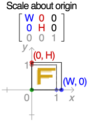

Horizontal flip: 50%;

X-shear: 33% (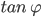: -0.2\~0.2)

Y-Shear: 33% (: -0.2\~0.2)

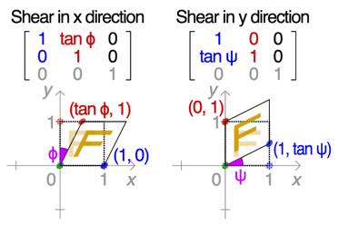

Rotation: 33% (: -0.2\~0.2)

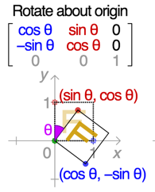

X-translate (offset): -16 \~ 16 pixels

Y-translate (offset): -16 \~ 16 pixels

Color Distortion:

Model averaging

Each time we apply an FMP network, either for training or testing
purposes, we use different random or pseudorandom sequences to generate
the pooling regions. An FMP network can therefore be thought of as an
ensemble of similar networks, with each different pooling-region
configuration defining a different member of the ensemble. This is
similar to dropout; the different values the dropout mask can take
define an ensemble of related networks. As with dropout, model averaging
for FMP networks can help improve performance. If you classify the same
test image a number of times, you may get a number of different
predictions. Using majority voting after classifying each test image a
number of times can substantially improve accuracy; see below.

Implementation {#h.14xe9gdj27ub .c29}
--------------

We are using an open source project in:
[https://github.com/btgraham/SparseConvNet](https://www.google.com/url?q=https://github.com/btgraham/SparseConvNet&sa=D&ust=1500874761081000&usg=AFQjCNFC6fuZITa04Qj3l-TkWNojNDhZ0g)

We are using a Mac Pro to run the program, with configuration:

-   Mac OS 10.11
-   Intel Core i7 2.30GHz CPU
-   16 GB 1600 MHz DDR3 RAM
-   500GB SSD
-   NVIDIA GeForce GT 750M 2048 MB

Because it’s a c++ project, need to build using cuda in Ubuntu, we have
to change the code a little bit to let the compiler(nvcc) work. Besides,
the network training needs around 1.5G memory space, while the GPU just
has 750MB free space, we have to change the memory allocation from GPU
to main memory, causing the performance drops to 500 seconds per epoch.

It takes 213382 seconds for training 410 epochs to the network, which is
almost 60 hours.

Result {#h.p89dicp9aywh .c29}
------

The original project achieves 96.53% accuracy, and the project we use
achieves 94.8% accuracy after 410 epochs training, the test error of the
network is around 5.2%. The network’s training mistake drop suddenly
from 5.4% to 2.99% after 400 epochs, seems it has over-fitted and we
stop the training.

Conclusion {#h.1x96snnvh2fe .c47}
==========

We use three different methods to test the accuracy. The first method is
Convolutional Neural Networks By Caffe, it is comprised of many
convolutional layers. The Accuracy of this method is 78%. Although it is
not very high accuracy, the executed time is impressive. The second
method is Histogram of Oriented Gradients and linear support vector
Machine. HOG features can be described as taking a nonlinear function of
the edge orientations in an image and pooling them into small spatial
regions to remove sensitivity to exact localisation of the edges. This
type of representation has proven particularly successful at being
tolerant to non-rigid changes in object geometry whilst maintaining high
selectivity.The last method is Fractional max-Polling with CNN, it
trained convolutional networks with fractional max-pooling on a number
of popular datasets. Although it has high accuracy, the execution time
is extremely slow.

 {#h.257n8t4hbcc0 .c40}

Reference {#h.egh6z0uolj34 .c47}
=========

-   CIFAR-10,
    [https://www.kaggle.com/c/cifar-10](https://www.google.com/url?q=https://www.kaggle.com/c/cifar-10&sa=D&ust=1500874761085000&usg=AFQjCNFvWErFL7rxh6ksXsaGLKRQnKpmLg) 
-   CNN with fractional max-pooling:
    [http://arxiv.org/pdf/1412.6071v4.pdf](https://www.google.com/url?q=http://arxiv.org/pdf/1412.6071v4.pdf&sa=D&ust=1500874761085000&usg=AFQjCNEHuC3RUaFfC0s8Jtli20gCUnBU1g)
-   CNN:
    [http://cs231n.github.io/convolutional-networks/](https://www.google.com/url?q=http://cs231n.github.io/convolutional-networks/&sa=D&ust=1500874761086000&usg=AFQjCNG0ttoKjNAba7Q3f0okd2rAfPfaig)
-   Spatially-sparse convolutional neural networks:

[http://arxiv.org/pdf/1409.6070v1.pdf](https://www.google.com/url?q=http://arxiv.org/pdf/1409.6070v1.pdf&sa=D&ust=1500874761087000&usg=AFQjCNGO7bUwiPIznSULTIfMVjfOVpbFXg);

[https://github.com/btgraham/SparseConvNet](https://www.google.com/url?q=https://github.com/btgraham/SparseConvNet&sa=D&ust=1500874761087000&usg=AFQjCNE7-CgQOKxwDu-QvZbUZySNIXpgeA);

[https://github.com/btgraham/SparseConvNet/wiki/Installation](https://www.google.com/url?q=https://github.com/btgraham/SparseConvNet/wiki/Installation&sa=D&ust=1500874761088000&usg=AFQjCNH1-CilgMuCb4CrkX8T5AvPvVWQ7Q)

-   Dropout:
    [http://jmlr.org/papers/volume15/srivastava14a/srivastava14a.pdf](https://www.google.com/url?q=http://jmlr.org/papers/volume15/srivastava14a/srivastava14a.pdf&sa=D&ust=1500874761088000&usg=AFQjCNF400XvpKvyk6ldJM18_cVKZOS24A)
-   CUDA:
    [https://github.com/BVLC/caffe/wiki/Ubuntu-14.04-VirtualBox-VM](https://www.google.com/url?q=https://github.com/BVLC/caffe/wiki/Ubuntu-14.04-VirtualBox-VM&sa=D&ust=1500874761089000&usg=AFQjCNE3YEfjzQOmvVOPytq38qsof5149A)
-   Neural Network:
    [http://cs231n.github.io/neural-networks-1/](https://www.google.com/url?q=http://cs231n.github.io/neural-networks-1/&sa=D&ust=1500874761089000&usg=AFQjCNFSwJFsLMfvjME7SDn9rX4PIC49wQ)
-   Affine Transformation:
    https://en.wikipedia.org/wiki/Transformation\_matrix

