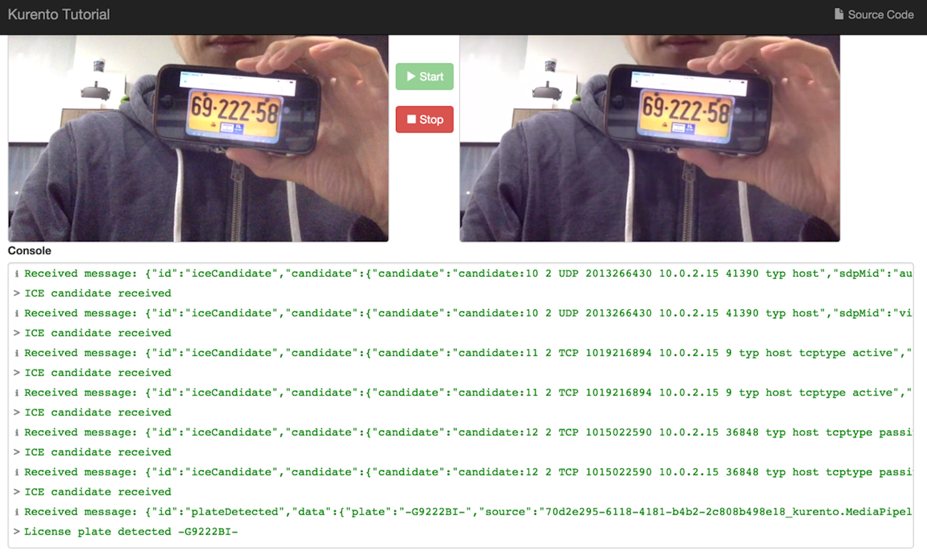
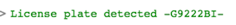
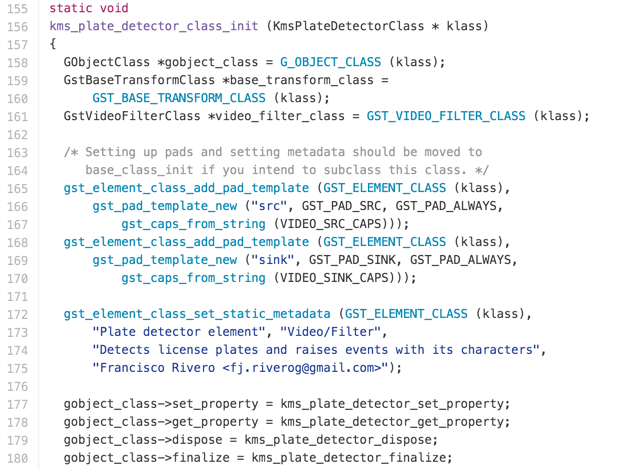
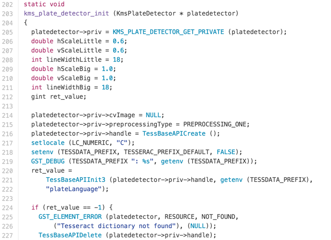
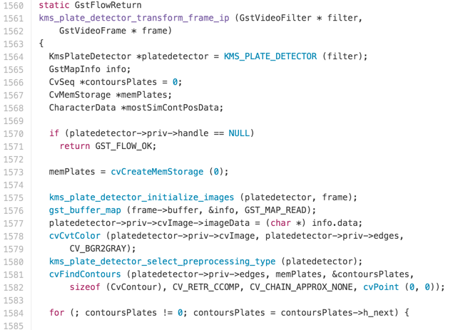
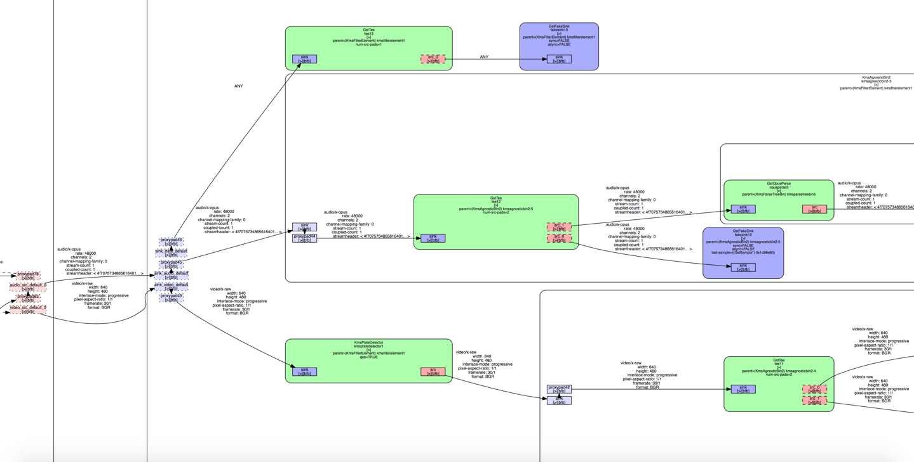


One of the things I really appreciate about a good architecture is when you have a defect in your app and you know exactly where to go to fix it.

## Why Ember?

* Support MVVM, two-way Data-binding (NOTE:  Ember 2.0 is embracing Data Down, Actions Up (DDAU) approach instead.):

    * Write dramatically less code with Ember's Handlebars integrated templates that update automatically when the underlying data changes.

* Ember ecosystem:

    * Don't waste time making trivial choices. Ember.js incorporates common idioms so you can focus on what makes your app special, not reinventing the wheel.

* Fast development for MVP:

    * Ember.js is built for productivity. Designed with developer ergonomics in mind, its friendly APIs help you get your job done—fast.

## Core Concepts of Ember:



### Router and Route Handlers

Router is a hash that maps uris to routes.

The route handler typically does two things:

* It renders a template.

* It loads a model that is then available to the template.

**_Route handler acts as ViewModel in MVVM._**

### Templates

Ember templates use the syntax of [Handlebars](http://handlebarsjs.com/) templates. Anything that is valid Handlebars syntax is valid Ember syntax.

Templates can also display properties provided to them from their context, which is either a component or a route (technically, a controller presents the model from the route to the template, but this is rarely used in modern Ember apps and will be deprecated soon). For example:

```hbs
 <div>Hi {{name}}, this is a valid Ember template!</div></td>
```


Here, `{{name}}` is a property provided by the template's context.

Besides properties, double curly braces `{{}}` may also contain helpers and components, which we'll discuss later.

**_We can think of Template as View in MVVM_**

### Components

While templates describe how a user interface looks, components control how the user interface behaves.

Components consist of two parts: a template written in Handlebars, and a source file written in JavaScript that defines the component's behavior. For example, our property rental application might have a component for displaying all the rentals called all-rentals, and another component for displaying an individual rental called rental-tile. The rental-tile component might define a behavior that lets the user hide and show the image property of the rental.

**_The first part of Components is the View in MVVM, as well as the second part is the ViewModel._** 

### Models

Models represent persistent state.

A model typically persists information to a web server, although models can be configured to save to anywhere else, such as the browser's Local Storage.

**_Obviously, Models are the Model in MVVM._**

## Data Flow

### The Store and a Single Source of Truth

Ember Data gives you a single store that is the central repository of models in your application. Components and routes can ask the store for models, and the store is responsible for knowing how to fetch them.

### Convention Over Configuration with JSON API

Ember Data is designed to work out of the box with [JSON API](http://jsonapi.org/).

### Architecture Overview

The first time your application asks the store for a record, the store sees that it doesn't have a local copy and requests it from your adapter. Your adapter will go and retrieve the record from your persistence layer; typically, this will be a JSON representation of the record served from an HTTP server.

Because of the asynchronicity, the store immediately returns a promise from the find()method.

Once the request to the server returns with a JSON payload, the adapter resolves the promise it returned to the store with the JSON. The store then takes that JSON, initializes the record with the JSON data, and resolves the promise returned to your application with the newly-loaded record. If you request a record that the store already has in its cache. It returns a promise that it resolves with the record immediately.



## Data Binding

### Defining Models

A model is a class that defines the properties and behavior of the data that you present to the user. To create a model, e.g a campaign, run:

```
ember generate model campaign
```

This will generate the following file:
```javascript
//app/models/campaign.js
import Ember from 'ember';
export default DS.Model.extend({
});
```

After you have defined a model class, you can start [finding](https://guides.emberjs.com/v2.9.0/models/finding-records) and [working with records](https://guides.emberjs.com/v2.9.0/models/creating-updating-and-deleting-records) of that type.

### Relationships

Let’s focus on one-to-many relationships. Let’s say we have two data models: Campaign & Inventory.

[campaign](https://github.com/swarmnyc/AppTalks/blob/ads/dev/AdPortal/frontend/app/models/campaign.js) ---(hasMany)---> inventory as inventories;

[inventory](https://github.com/swarmnyc/AppTalks/blob/ads/dev/AdPortal/frontend/app/models/campaign-episode.js) ---(belongsTo)---> campaign as campaign;

```javascript
//app/models/campaign.js
import Ember from 'ember';
export default DS.Model.extend({
  name: attr('string'),
  startDate: attr('date'),
  endDate: attr('date'),
  status: attr('string', { defaultValue: 'Draft' }),
  inventories: hasMany('inventory'),
});
```

```javascript
//app/models/campaign.jsapp/models/inventory.js
import Ember from 'ember';
export default DS.Model.extend({
  title: attr('string'),
  price: attr('number'),
  target: attr('number'),
  campaign: belongsTo('campaign'),
});
```

Here are some scenarios you will manipulate the relationship.

* Create new campaign and a few new inventories;

```javascript
function createCampaignWithInventories(inventories) {
  let campaign = store.createRecord('campaign');
  let inventory = store.createRecord('inventory');
  inventories.addObject(inventory);
  this.set('showWaitingSpinner', true);
  campaign.save().then( (savedCampaign) => {
    inventories.setEach('campaign', savedCampaign);
    Ember.RSVP.all(inventories.invoke('save')).then( () => { 
      this.set('showWaitingSpinner', false);
    });
  }).catch( (err) => {
    this.set('showWaitingSpinner', false);
    this.set('errorMessage', err);
  });
}
```

* Update campaign’s attributes;

```javascript
function updateCampaign(campaign) {
  this.set('showWaitingSpinner', true);
  campaign.set('name', 'Amazing Campaign');
  campaign.save().then( () => {
    this.set('showWaitingSpinner', false);
  });
}
```


* Update attributes within some inventories:

```javascript
function updateInventories(inventories) {
  this.set('showWaitingSpinner', true);
  inventories.forEach( (inventory) => {
    inentory.set('price', 0.12);
  });
  Ember.RSVP.all(inventories.invoke('save')).then( () => { 
    this.set('showWaitingSpinner', false);
  });
}
```

* Insert a few new inventories to an existing campaign:

```javascript
function addInventories(campaign, inventories) {
  this.set('showWaitingSpinner', true);
  let inventory = store.createRecord('inventory');
  inventories.addObject(inventory);
  inventories.forEach( (inventory) => {
    inventory.set('campaign', campaign);
  });
  Ember.RSVP.all(inventories.invoke('save')).then( () => { 
    this.set('showWaitingSpinner', false);
  });
}
```

* Delete a few inventories from an existing campaign:

```javascript
function deleteInventories(inventories) {
  this.set('showWaitingSpinner', true);
  Ember.RSVP.all(inventories.invoke('destroyRecord')).then( () => { 
    this.set('showWaitingSpinner', false);
  });
}
```

* Load a campaign and its inventories:

```javascript
function findCampaign(campaign_id) {
  return store.findRecord('campaign', campaign_id);
}
```

Inventories within the campaign will automatically be loaded when template try to show them. ([more detail](http://stackoverflow.com/questions/30219519/ember-js-loading-related-models-directly?answertab=votes#tab-top)), though one request to server per inventory. For efficiency, you can use Ember sideload to include all data in one-to-many relationship by one request. ([JSON-API correct handling of included entities #3380](https://github.com/emberjs/data/issues/3380))

### Computed Property & Observer

In a nutshell, computed properties let you declare functions as properties. You create one by defining a computed property as a function, which Ember will automatically call when you ask for the property. You can then use it the same way you would any normal, static property.

```javascript
//app/models/inventory.js
import Ember from 'ember';
export default DS.Model.extend({
  title: attr('string'),
  price: attr('number'),
  target: attr('number'),
  priceWithDollar: Ember.computed(price, function() {
    return '$' + this.get(price);
  }),
});
```


It's super handy for taking one or more normal properties and transforming or manipulating their data to create a new value.

```javascript
import Ember from 'ember';
export default DS.Model.extend({
  title: attr('string'),
  price: attr('number'),
  target: attr('number'),
  cost: Ember.computed('price', 'target', function() {
    return Math.round(this.get('price') * this.get('target') * 100) / 100;
  }),
})
```

Computed properties, by default, observe any changes made to the properties they depend on and are dynamically updated when they're called. Let's use computed properties to dynamically update.

```javascript
function test() {
  inventory.set('price', 1.0);
  inventory.set('target', 1000);
  inventory.get('cost'); // return 1000.0


  inventory.set('price', 2.0);
  inventory.get('cost'); // return 2000.0
}
```

Sometimes you have a computed property whose value depends on the properties of items in an array.

```javascript
//app/components/campaign-episode-cost-subtotal.js
import Ember from 'ember';
export default Ember.Component.extend({
  sumCost: Ember.computed("model.@each.target", function() {
    const selectedEpisodes = this.get('model');
    let sumCost = 0;
    selectedEpisodes.forEach( (episode) => {
      sumCost += episode.get('cost');
    });
    return sumCost.toFixed(2);
  }),
});
```

Or you can use computed macro to filter an array by the keyword. You will get a new filter array whenever the keyword or original array changed.

```javascript
//app/components/campaign-table-select.js
import Ember from 'ember';
export default Ember.Component.extend({
  filteredModel: Ember.computed.filter('model', function(item) {
    const keyword = this.get('keyword');
    if (Ember.isEmpty(keyword)) {
      return true;
    }
    if (Ember.isEmpty(item.get('name'))) {
      return false;
    }
    return item.get('name').includes(keyword);
  }).property('keyword', 'model.[]'),
});
```

### Changeset and Validations

Changeset represents a set of valid changes to be applied onto any Object (Ember.Object, DS.Model, POJOs, etc). Each change is tested against an optional validation, and if valid, the change is stored and applied when executed.

Given Ember's Data Down, Actions Up (DDAU) approach, a changeset is more appropriate compared to implicit 2 way bindings. ember-changeset only allows valid changes to be set, so your Objects will never become invalid (assuming you have 100% validation coverage). Additionally, this addon is designed to be un-opinionated about your choice of form and/or validation library, so you can easily integrate it into an existing solution.

```javascript
//app/routes/campaigns/create.js
import Changeset from 'ember-changeset';
import lookupValidator from 'ember-changeset-validations';
import CampaignValidations from 'frontend/validations/campaign';

...

  setupController(controller, model) {
    model.allEpisodes = model.episodes.toArray();
    controller.setProperties({ model: model, changeset: new Changeset(model.campaign, lookupValidator(CampaignValidations), CampaignValidations)});
    this.addEpisodesByIds(model.allEpisodes);
  },

...
```


The simplest way to incorporate validations is to use [ember-changeset-validations](https://github.com/DockYard/ember-changeset-validations/), a companion addon to this one. It has a simple mental model, and there are no Observers or CPs involved – just pure functions.

```javascript
//app/validations/campaign.js
import {
    validatePresence
} from 'ember-changeset-validations/validators';

import validateDateLater from 'frontend/validators/date-later-than';
import validateDateBeforeThan from 'frontend/validators/date-before-than';

export default {
    name: validatePresence(true),
    startDate: [
      validateDateLater( {message: "Should later than today."} )
    ],
    endDate: [
      validateDateLater({than: 'startDate', message: "Should later than start date."}),
      validateDateBeforeThan({ than: 'startDate', amount: 30, units: 'days' })
    ]
};
```


You could define your custom validator too, like "validateDateBeforeThan".

```javascript
//app/validators/date-before-than.js
import Ember from 'ember';
import _ from 'npm:lodash';
import moment from 'npm:moment';
import buildMessage from 'ember-changeset-validations/utils/validation-errors';

const { get } = Ember;

export default function validateDateBeforeThan({ than, amount = 0, units = 'h' } = {}) {
  return (key, newValue, oldValue, changes, content) => {
    const mesg = `Date must be less than ${amount} ${units} after ${than}`;
    let comparisonValue,isValid;
    if (_.isString(than)) {
      comparisonValue = moment(get(changes, than)).add(amount, units);
    } else {
      comparisonValue = moment(than).add(amount, units);
    }

    isValid = moment(newValue).isBefore(comparisonValue);
    return isValid === true || mesg;
  };
}
```


Once you set value to a property of the changeset or changeset.validate(), the validation will be happened to the property or all properties, and you can check the status and show the error messages if there were.


```hbs
//app/templates/components/campaign-date-select.hbs
...
      {{#grid-col medium=3 class="campaign-datepicker" }}
        {{fa-icon "calendar"}} {{pikaday-input format="MM/DD/YYYY" placeholder="Start Date" class=(if campaignChangeset.error.startDate " is-invalid-input" "") value=campaignChangeset.startDate onSelection=(action (mut campaignChangeset.startDate)) disabled=(not-eq campaignChangeset.status 'Draft')}}
        {{validation-errors changeset=campaignChangeset property="startDate"}}
      {{/grid-col}}
...
```


```hbs
//app/templates/components/validation-errors.hbs
{{#liquid-if (get changeset.error property)}}
  <span class="is-visible form-error">
  	<ul>
    	{{#each (get (get changeset.error property) "validation") as |message|}}
    		<li>{{message}}</li>
    	{{/each}}
    </ul>
  </span>
{{/liquid-if}}
```


Without using changeset, both two-way binding and DDAU will change the campaign name in  the campaign list and dialog.


With changeset, the campaign name in the campaign list will not change while you edit the name in the dialog.


## Reusable/Copyable Components: Layout, Event, Action

Every page(Referenced by [Route](https://docs.google.com/document/d/1S-F572wYWMW_kTseWUExvpVXjkXNPWL9y8e5j2ghzZo/edit#heading=h.e6kzlo78eyvm)) is rendered by a [Template](#heading=h.1l9c1imq6wbv), which is a container of different [Components](#heading=h.r988pzjj1qok) and/or Component hierarchies. The View of a Component use the syntax of [Handlebars](http://handlebarsjs.com/) templates, as same as a Template. You can think of Ember’s Layout Structure as a Handlebars template hierarchy. A well-designed reusable Component can be used in different Ember applications. Before you want to build a new Component, try to find a similar one [here](https://emberobserver.com/). Instead, most of the Components you write in your specific application are copyable. They are highly dependent to the data model and layout, once the context changed, they wouldn’t work properly. We are focusing on building these copyable components.

Some people suggest that you’ll find your components much easier to reuse and reason about if you divide them into two categories: [Presentational and Container Components](https://medium.com/@dan_abramov/smart-and-dumb-components-7ca2f9a7c7d0#.59ccb0lb1).

To define a component, run:

```
ember generate component my-component-name
```


Components must have at least one dash in their name. So campaign-edit is an acceptable name, and so is episode-table-select, but campaign is not. This prevents clashes with current or future HTML element names, aligns Ember components with the W3C [Custom Elements](https://dvcs.w3.org/hg/webcomponents/raw-file/tip/spec/custom/index.html) spec, and ensures Ember detects the components automatically.

### Defining a Component Handler(Subclass)

Often times, your components will just encapsulate certain snippets of Handlebars templates that you find yourself using over and over, and a subclass if you wanted to change a component's element, respond to actions from the component's template, or manually make changes to the component's element using JavaScript.

```javascript
import Ember from 'ember';
const BlogPostComponent = Ember.Component.extend({});
BlogPostComponent.reopenClass({
  positionalParams: ['title', 'body']
});
export default BlogPostComponent;
```


### Dynamically rendering a Component

The [{{component}}](http://emberjs.com/api/classes/Ember.Templates.helpers.html#method_component) helper can be used to defer the selection of a component to run time. The {{my-component}} syntax always renders the same component, while using the {{component}} helper allows choosing a component to render on the fly. This is useful in cases where you want to interact with different external libraries depending on the data. Using the {{component}} helper would allow you to keep different logic well separated.

The first parameter of the helper is the name of a component to render, as a string. So {{component 'campaign-list'}} is the same as using {{campaign-list}}.

The real value of [{{component}}](http://emberjs.com/api/classes/Ember.Templates.helpers.html#method_component) comes from being able to dynamically pick the component being rendered. Below is an example of using the helper as a means of choosing different components for displaying different kinds of posts:

### Passing Properties to a Component

Components are isolated from their surroundings, so any data that the component needs has to be passed in. Typically, you will pass Models and [Closure Actions](http://emberjs.com/blog/2015/06/12/ember-1-13-0-released.html#toc_closure-actions) to a Component. ([No longer bubbling actions by using sendAction](https://dockyard.com/blog/2015/10/29/ember-best-practice-stop-bubbling-and-use-closure-actions))

### Handling Events

Events are triggered by HTML object or Component, and handled by a Closure Action within a Handler of Component or Route. Normally, there are 4 ways of Event Handling.

1. HTML object → Component Handler (Within a Component)


```hbs
//app/templates/components/campaign-table-select.hbs (HTML object in a Component’s template)
<input type="text" onkeyup={{action "queryCampaign"}} class="search-icon-text" placeholder="&#xF002; Search Campaigns" />
```


```javascript
//app/components/campaign-table-select.js (Component’s Handler)
import Ember from 'ember';
export default Ember.Component.extend({
  actions: {
    queryCampaign(event) {
      const keyword = event.target.value;
      this.set('keyword', keyword);
    }
  }
});
```

2. HTML object → Route Handler ([Why directly to the Route?](https://dockyard.com/blog/2016/02/19/best-practices-route-actions))


```hbs
//app/templates/components/campaign-action-menu.hbs (HTML object)
<li><a href="#" {{action (route-action 'editCampaign' row.content)}}>Edit</a></li>
```

```javascript
//app/routes/campaigns/create.js (Route)
import Ember from 'ember';
export default Ember.Route.extend({
  actions: {
    editCampaign(campaign) {
      const keyword = event.target.value;
      this.transitionTo('campaigns.campaign', campaign.id);
    }
  }
});
```

3. Component → Container Component


```hbs
//app/templates/components/campaign-row.hbs (Component)
<a href="#" {{action onDuplicate campaign}}>{{fa-icon "files-o" title="Duplicate"}}</a>
```


or


```hbs
//app/templates/components/campaign-row.hbs (Component)
<a href="#" {{action 'duplicateMe'}}>{{fa-icon "files-o" title="Duplicate"}}</a>
```


```javascript
//app/components/campaign-row.js (Component)
import Ember from 'ember';
export default Ember.Route.extend({
  actions: {
    duplicateMe() {
      const campaign=this.get('campaign');
      this.onDuplicate(campaign);
    },
  }
});
```


```hbs
//app/templates/components/campaign-table-select.hbs (Container)
{{campaign-row campaign=campaign campaignEpisodes=campaignEpisodes episodes=episodes onCheck="checkCampaign" onDuplicate=(action "duplicateCampaign")}}
```


```javascript
//app/components/campaign-table-select.js (Container)
import Ember from 'ember';
export default Ember.Component.extend({
  actions: {
    duplicateCampaign(campaign) {
      campaign.copy().then(function(_copy) {
        _copy.set('showDialog', true);
        this.set('toBeCopiedCampaign', _copy);
      });
    },
  }
})
```

4. Component → Route Handler


```hbs
//app/templates/components/creative-select.hbs (Component)
<a href="#" {{action onremove this)}}>Remove Creative</a>
```

or

```hbs
//app/templates/components/creative-select.hbs (Component)
<a href="#" {{action 'removeCreative' this}}>Remove Creative by Handler</a>
```

```javascript
//app/components/creative-select.js (Component)
import Ember from 'ember';
export default Ember.Component.extend({
  actions: {
    removeCreative(creative) {
      this.onremove(creative);
    },
  }
});
```


```hbs
//app/templates/components/campaign-edit.hbs (Container)
{{creative-select selectedCreatives=model.selectedCreatives onaddmedia="addMedia" onaddcreative="addCreative" onremove=(route-action "removeCreative") creatives=model.creatives media=model.media }}
```

```javascript
//app/routes/application.js (Route)
import Ember from 'ember';
export default Ember.Route.extend({
  actions: {
    removeCreative(c) {
      c.deleteRecord();
      c.save();
    },
  }
});
```


### Handling Action Completion

Often [Closure Actions](http://emberjs.com/blog/2015/06/12/ember-1-13-0-released.html#toc_closure-actions) perform asynchronous tasks, such as making an ajax request to a server. You return a [Promise](http://emberjs.com/api/classes/RSVP.Promise.html) from these actions to handle completion.

```hbs
//app/templates/components/episode-table-select.hbs (Component)
<a href="#" class="button primary expanded hollow" {{action "viewmore"}}>
  {{#if isLoading}}{{loading-spinner}}{{/if}} View More
</a>
```


```javascript
//app/components/episode-table-select.js (Component)
import Ember from 'ember';
export default Ember.Component.extend({
  actions: {
    viewmore() {
      this.set('isLoading', true);
      this.onviewmore().finally( () => {
        this.set('isLoading', false);
      });
    },
  }
});

```


```hbs
//app/templates/campaigns/list.hbs (Container Component)
{{episode-table-select model=model.episodes onviewmore=(action "getMoreEpisodes") }} 
```
Or
```hbs
//app/templates/campaigns/list.hbs (Route)
{{episode-table-select model=model.episodes onviewmore=(action (route-action "getMoreEpisodes")) }} 
```

```javascript
//app/routes/campaigns/list.js (Component or Route)
import Ember from 'ember';
export default Ember.Route.extend({
  actions: {
    getMoreEpisodes() {
      const params = this.get('episodesQueryParams');
      const store = this.get('store');
      const skip = params.incrementProperty('skip', params.get('limit'));
      const limit = params.get('limit');
      return store.query('episode', params);
    },
  }
});
```

## Application Concerns

### Dependency Injection

Ember applications utilize the [dependency injection](https://en.wikipedia.org/wiki/Dependency_injection) ("DI") design pattern to declare and instantiate classes of objects and dependencies between them. You can inject a router, services or Components into any class that requires instantiation.

```javascript
//app/initializers/component-router-injector.js
export function initialize(application) {
  // Injects all Ember components with a router object:
  application.inject('component', 'router', 'router:main');
}

export default {
  name: 'component-router-injector',
  initialize: initialize
};
```


```javascript
//app/routes/settings.js
import Ember from 'ember';
import AuthenticatedRouteMixin from 'ember-simple-auth/mixins/authenticated-route-mixin';

export default Ember.Route.extend(AuthenticatedRouteMixin, {
  // services Ad Hoc injection:
  stripe: Ember.inject.service('stripe'),
  notifications: Ember.inject.service('notification-messages'),
...
```


One of the major advantages of dependency injection is that it can make testing(especially unit test) lots easier. 

### Services

An Ember.Service is an Ember object that lives for the duration of the application, and can be made available in different parts of your application.

Services are useful for features that require shared state or persistent connections. Example uses of services might include: User/session authentication; Geolocation; WebSockets; Server-sent events or notifications; Server-backed API calls that may not fit Ember Data; Third-party APIs; Logging. To create a service, run:

```
ember generate service stripe
```


```javascript
//app/services/stripe.js
import Ember from 'ember';
import config from 'apptalks-adportal-frontend/config/environment';

export default Ember.Service.extend({
  session: Ember.inject.service('session'),
  _submitPayment(stripeToken) {
    return new Ember.RSVP.Promise((resolve, reject) => {
      const data = {
        stripeToken: stripeToken,
        amount: this.get('amount') * 100,
        campaignId: this.get('campaign.id')
      };

      this._request(`${config.api.host}/payment`, 'post', data).then(resolve).catch(reject);
    });
  },
...
```


## Testing

### Acceptance Test

Let’s say we want to do 2 acceptance tests: register a user, list a user’s campaigns. Run "ember generate acceptance-test <name>" to to create an acceptance test,

```
ember generate acceptance-test register
```


and then write some test code within.

```javascript
//tests/acceptance/register-test.js
import { test } from 'qunit';
import moduleForAcceptance from 'frontend/tests/helpers/module-for-acceptance';
moduleForAcceptance('Acceptance | register');


test('visiting /register', function(assert) {
  visit('/register');

  fillIn("input[placeholder^='Company']", 'TaoRen');
  fillIn("input[placeholder^='First']", 'Tao');
  fillIn("input[placeholder^='Last']", 'Ren');
  fillIn("input[placeholder^='Email']", 'tao@swarmnyc.com');
  fillIn("input[placeholder^='Mobile']", '9292123423');
  fillIn("input[placeholder^='Password']", 'tao');
  click('button.button');

  andThen(function() {
    assert.equal(currentURL(), '/register');
  });
});
```


Similar to campaigns acceptance test,

```
ember generate acceptance-test campaigns
```


```javascript
//tests/acceptance/campaigns-test.js
import { test } from 'qunit';
import moduleForAcceptance from 'frontend/tests/helpers/module-for-acceptance';
import startApp from '../helpers/start-app';
import { authenticateSession } from '../helpers/authenticate';
moduleForAcceptance('Acceptance | campaigns');


test('visiting /campaigns', function(assert) {
  authenticateSession();
  visit('/campaigns');

  andThen(function() {
    assert.equal(currentURL(), '/campaigns');
  });
});

```


In order to show user’s campaigns, we need a helper to authenticate the session, which is done by login somehow.

```javascript
//tests/helpers/authenticate.js
import startApp from '../helpers/start-app';
import config from '../../config/environment';

export function authenticateSession() {
  const application=startApp();
  const { __container__: container } = application;
  const session = container.lookup('service:session');

  session.authenticate("authenticator:oauth2", 'tao@swarmnyc.com', 'tao');
  return wait();
};
```


Start the test server: ember test --server

```
ember test --server
```


Run the test in a browser: [http://localhost:7357/](http://localhost:7357/)

The acceptance test of register failed because the user already existed.



The acceptance test of campaigns passed because we login (by authenticating the session) with the existing user account.



## Deploy

### Deploy to Amazon S3 Bucket ([More Detail](http://ember-cli-deploy.com/docs/v0.6.x/s3-walkthrough/))

# Install add-ons

```
ember install ember-cli-deploy
ember install ember-cli-deploy-build
ember install ember-cli-deploy-s3
ember install ember-cli-deploy-s3-index ember-cli-deploy-revision-data ember-cli-deploy-display-revisions
ember install ember-cli-deploy-gzip
ember install ember-cli-deploy-manifest
```

# Deploy using ‘production’ config.

```
ember deploy production
```

# Deploy and Active production

```
ember deploy --activate=true production
```

# Check deployed reversions

```
ember deploy:list production

   timestamp           | revision                       

 =================================                      	

   2016/11/18 17:11:04 | 3ce9112a62d4eaefbc9f0d55cf82d3d0 

   2016/11/18 11:14:44 | b8b43c20be73530e561e3608b6c9d63c 

   2016/11/17 10:10:41 | a6c4d9d94f7b36ab9874ff821e59e912 

   2016/11/14 21:47:17 | 5f4394c83b11201ed70836d308606323 

 > 2016/11/14 21:05:04 | f8216619c2d2897d83e8a614c4d3c8f5 
```
# Active a reversion

ember deploy:activate production --revision f8216619c2d2897d83e8a614c4d3c8f5

At this point, if you’re using history as your locationType, you may run into some problems. There are two ways of solving this: [Using S3’s redirection rules](https://github.com/ember-cli-deploy/ember-cli-deploy-s3-index#using-history-location) or switching to the hash locationType.

If you choose to switch from history to hash, change the configuration in your config/environment.js file and then deploy again.

```javascript
var ENV = {
  // ...
  locationType: 'hash', // 'auto',
}
```


## Fast Hands

### IDE - Atom

Plugins:

* **Ember CLI Helper**

* **Fuzzy Finder**

* **a****[tom-beautif**y](https://github.com/Glavin001/atom-beautify)

* **platformio-ide-terminal**

Keybindings:

* **ctrl-alt-e(switch-controller-template),**

* **ctrl-alt-r(switch-route-template),**

* **cmd-b(auto-indent),**

* **cmd-e(switch-recent-tab),**

* **cmd-t(switch-finder-file),**

* **cmd-r(find symbols), etc.**

### Ember-twiddle

JSFiddle type thing for ember-cli style code [http://ember-twiddle.com](http://ember-twiddle.com/)

### 

### Ember-cli-mirage

Mock API backend server: [http://www.ember-cli-mirage.com/docs/v0.2.x/models/](http://www.ember-cli-mirage.com/docs/v0.2.x/models/)

Mirage use [faker.js](https://github.com/marak/Faker.js/) to generate massive amounts of fake data in the browser and node.js

### Ember-browserify

This is an ember-cli addon for easily loading CommonJS modules from npm via browserify.

You can easily use the npm modules: e.g. lodash, moment, etc.

```javascript
//app/validators/date-before-than.js
import Ember from 'ember';
import _ from 'npm:lodash';
import moment from 'npm:moment';
const { get } = Ember;

export default function validateDateBeforeThan({ than, amount = 0, units = 'h' } = {}) {
  return (key, newValue, oldValue, changes, content) => {
    const mesg = `Date must be less than ${amount} ${units} after ${than}`;
    let comparisonValue,isValid;
    if (_.isString(than)) {
      comparisonValue = moment(get(changes, than)).add(amount, units);
    } else {
      comparisonValue = moment(than).add(amount, units);
    }

    isValid = moment(newValue).isBefore(comparisonValue);
    return isValid === true || mesg;
  };
}
```


Read more: [How to use third party npm packages with ember cli app](http://stackoverflow.com/questions/26544578/how-to-use-third-party-npm-packages-with-ember-cli-app)

### Ember CLI Foundation 6 SASS

An wrapper to [Foundation for Sites](http://foundation.zurb.com/sites/docs/).

[Getting Started](https://github.com/acoustep/ember-cli-foundation-6-sass). Some [issue on ember 2.10 and workaround](https://github.com/acoustep/ember-cli-foundation-6-sass/issues/48).

## More Readings

### [Data down, actions up](http://www.samselikoff.com/blog/data-down-actions-up/)

## 

### [actions-up-data-sideways](http://forspareparts.github.io/2016/01/24/actions-up-data-sideways/)

### [Ember Best Practices](https://dockyard.com/blog/categories/best-practices)

