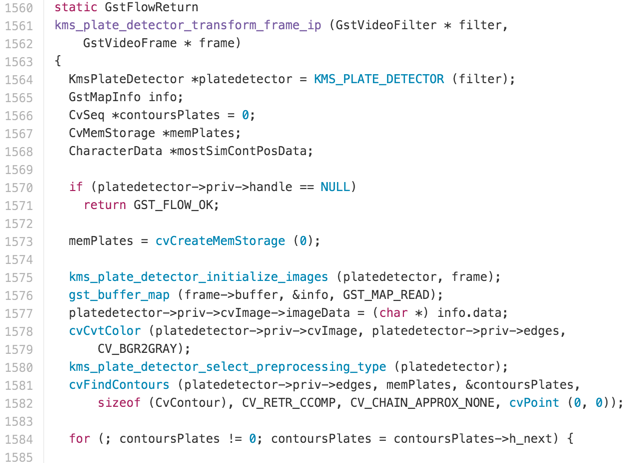
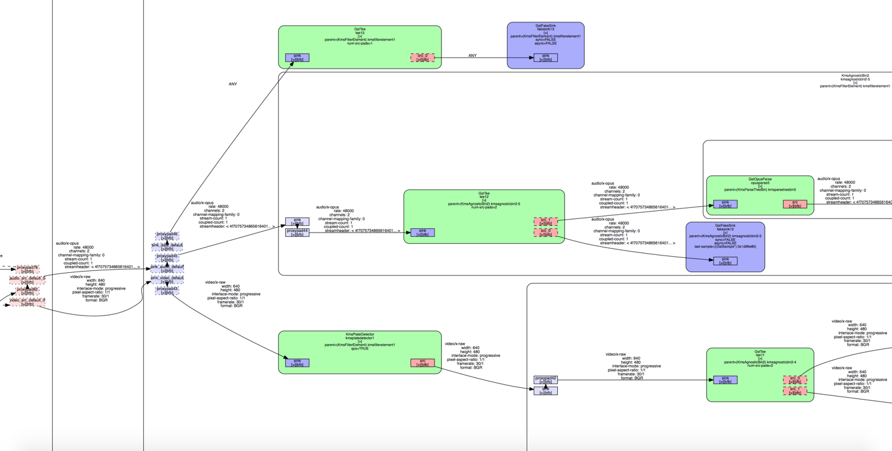

# Application Pipeline in AWS

## Target Groups setup

1. AWS console ⇒ EC2:

2. Target Groups ⇒ Create target group

3. Create 2 groups
    * Ludlow2-api-qa
    * Ludlow2-api-prod

The port doesn’t matter, keep it as default: 80.

## Load Balancer setup

1. AWS console ⇒ EC2 ⇒ Load Balancers ⇒ Create Load Balancer
 
2. Select: Application Load Balancer

3. Add 2 Listeners: HTTP / HTTPS, Select All Availability Zones.

4. Choose a certificate

5. Select an existing security group: default

6. New target group or Select existing one: Ludlow2-api-prod. Port doesn’t matter, keep it as default: 80.

7. No need to Register Targets, which will be register automatically by our ECS Services.

8. Review and Create

9. Select the new created Load Balancer: Ludlow2 ⇒ Listeners: 80/443 ⇒ View/edit rules

10. Add a rule: If Host is qa.ludlow.io forward to Target Group: Ludlow2-api-qa

## EC2 Instance setup

The EC2 instance where we need to add an inbound rule letting a Load Balancer redirect the request, should be created while creating ECS Cluster below.

1. AWS console ⇒ EC2 ⇒ Instances ⇒ Ludlow2 ⇒ click Security groups

2. Inbound ⇒ Edit

3. Add Rule, Type pick All TCP, Source input the Security Group ID(sg-964aa2ef) from Load Balancer: Ludlow2
   

## ECS Cluster setup

1. AWS console ⇒ Elastic Container Service:

2. Clusters ⇒ Create Cluster

3. Select EC2 Linux + Networking

4. Use default EC2 instance.

5. Networking use existing VPC, Subnet, and Security group. Security group should be the same as the one in Load Balancer, i.e. default.

## ECR Repositories setup

1. AWS console ⇒ Elastic Container Service ⇒ Repositories ⇒ Create repository

2. Create two repositories: ludlow2-api-qa, ludlow2-api-prod.

3. Write down the commands, which will be used in CI platform: TeamCity.

## ECS Task Definitions setup

1. AWS console ⇒ Elastic Container Service ⇒ Task Definitions ⇒ Create new Task Definition

2. Select EC2 as launch type compatibility

3. Configure task and container definitions

4. Add container

5. Standard configuration:
    * Image points to the Repository we just created: ludlow2-api-qa
    * Memory Limits should set to Hard limit for qa, just in case of affecting the prod Task’s memory
    * Port mappings: Host port must be set to 0, in order to register to a Target Group with a dynamic port, which allow two different Tasks([Blue/Green Deployment](https://docs.cloudfoundry.org/devguide/deploy-apps/blue-green.html)) running at the same time, one for old version image, one for new version image. Container port is whatever you set in application’s Dockerfile.

6. Advanced container configuration
    * STORAGE AND LOGGING ⇒ Log configuration ⇒ check Auto-configure CloudWatch Logs, this makes sure all the console log will go to CloudWatch.

## ECS Services setup

1. AWS console ⇒ Elastic Container Service ⇒ Clusters ⇒ Ludlow2
    
2.  Services ⇒ Create
    
3. Configure services
    
    * Make sure Maximum percent * Number of tasks >= Number of tasks + 1, letting your new task can be started while the old one is stopping.
4. Configure network
    * Load balancer type: Application Load Balancer
    
    * Select Load Balancer: Ludlow2, Click Add to load balancer
    
    * Target group name, pick Ludlow2-api-qa
    

