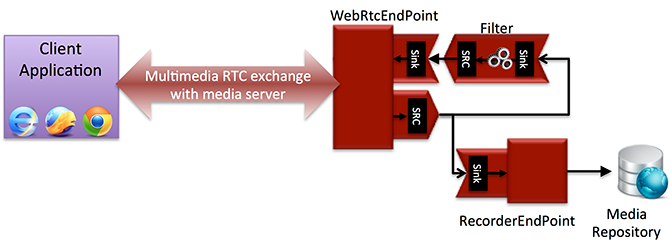
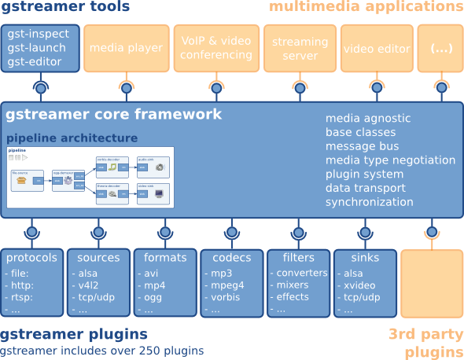

# Deployment Architecture

At SWARM we have agreed on the following goals for deploying apps into the wild. 

Goals:

* Automaticity

    * Deployment should be done automatically, e.g. by a CI platform.

* Reproducible

    * Production environment should be the same as the development environment.

    * Issues in production should be easy to reproduce in development.

* Elasticity

    * Easy to scale up or down the service without changing the code.

* Smoothness

    * Zero-Downtime while scaling or upgrading the service.

* Traceability

    * Logging

    * Monitoring

Our current workflow is as follows. 

1. Developers commit code / update scripts to git. We use [gitflow](https://www.atlassian.com/git/tutorials/comparing-workflows/gitflow-workflow) to track our environments.

2. Our PM & QA team pick up builds from our CI Platform of choice: TeamCity. 

3. We use a combination of TeamCity & AWS Application Pipeline to generate builds for the different environments. 

## AWS Application Pipeline

When we try to deploy an application in AWS, let’s say [Ludlow2](http://ludlow.io), we should set up an application pipeline first. 

# 

A typical pipeline includes:

* One [Load Balancer](https://docs.aws.amazon.com/elasticloadbalancing/latest/application/application-load-balancers.html)

* Several [Target Groups](https://docs.aws.amazon.com/elasticloadbalancing/latest/application/load-balancer-target-groups.html) (each for one branch: dev, qa, prod)

    * Each Target Group is used to route requests to one or more registered targets by a Load Balancer listener rule. 

* One [ECS cluster](https://docs.aws.amazon.com/AmazonECS/latest/developerguide/ECS_clusters.html)

    * An Amazon ECS cluster is a logical grouping of tasks or services.

* Several [ECS services](https://docs.aws.amazon.com/AmazonECS/latest/developerguide/ecs_services.html) (each for one branch: dev, qa, prod)

    * ECS service is a specified number of instances of a task definition you can run and maintain simultaneously in an Amazon ECS cluster. 

* Several [ECR repositories](https://docs.aws.amazon.com/AmazonECS/latest/developerguide/ECS_Console_Repositories.html) (each for one branch: dev, qa, prod)

    * ECR is a managed AWS Docker registry service which supports private Docker repositories. You can use the Docker CLI to author and manage images.

* One [EC2 instance](https://docs.aws.amazon.com/AWSEC2/latest/UserGuide/concepts.html)

    * An EC2 instance provides scalable computing capacity in the Amazon Web Services (AWS) cloud. 

### Prerequisite

* AWS account

* Site domain name for your application, e.g.

* *.ludlow.io

* qa.ludlow.io

* prod.ludlow.io

* Site certificate

### Application Pipeline Setup

1. [ECR Repositories](https://docs.google.com/document/d/1hHJy1756M41ltcxTiJfHN0NqLWyULVFWMPpBMwb_uJY/edit#heading=h.x6752nyztcz0)

Create ECS Repositories first, where the Dev team could build and push the application’s Docker image.

2. [Target Groups](https://docs.google.com/document/d/1hHJy1756M41ltcxTiJfHN0NqLWyULVFWMPpBMwb_uJY/edit#heading=h.ygujh57f0b5w)

Target Groups are referenced by Load Balancer. Let’s create them before doing Load Balancer.

3. [Load Balancer](https://docs.google.com/document/d/1hHJy1756M41ltcxTiJfHN0NqLWyULVFWMPpBMwb_uJY/edit#heading=h.imseuqyhx0z5)

	After a Load Balancer is created, you will get a DNS name(A Record) of it. Point all your site domain name to this DNS name.

4. [ECS Cluster](https://docs.google.com/document/d/1hHJy1756M41ltcxTiJfHN0NqLWyULVFWMPpBMwb_uJY/edit#heading=h.o1zgmphfar5d)

	ECS Cluster is a container, where we can create Task Definitions and Services. An EC2 instance will also be created automatically while creating the ECS Cluster.

5. [ECS Task Definitions](https://docs.google.com/document/d/1hHJy1756M41ltcxTiJfHN0NqLWyULVFWMPpBMwb_uJY/edit#heading=h.fuu1rfpxgelv)

Specify which Docker image should be used, how much CPU and memory to use, whether should the console logging message redirect to CloudWatch.

6. [ECS Services](https://docs.google.com/document/d/1hHJy1756M41ltcxTiJfHN0NqLWyULVFWMPpBMwb_uJY/edit#heading=h.sfn95niqo1zz)

	Specify how many tasks should be run, which Task Definition should be use, which Target Group as well as Load Balancer should be register to.

7. [EC2 instance](https://docs.google.com/document/d/1hHJy1756M41ltcxTiJfHN0NqLWyULVFWMPpBMwb_uJY/edit#heading=h.e4huqa16zz58)

	EC2 instance are created within ECS Cluster. We need to add an Inbound rule letting the Load Balancer redirect requests to.

## TeamCity CI flow

We are using [TeamCity](http://34.224.141.66/) as continuous-integration platform for testing, building, and deployment. TeamCity has one Server Instance running on a AWS ec2, and multiple Build Agents running either on a AWS ec2, or a on-premises build machine. [Here](https://github.com/swarmnyc/teamcity-buildagent-docker-images#create-a-restartable-docker-container) is the scripts to run these 2 kinds of servers.

The official Build Agent is great, little support for Node.js and AWS though. We create a public [GitHub project](https://github.com/swarmnyc/teamcity-buildagent-docker-images) to building our own customized Build Agent, where we setup a Node.js development environment and install AWS CLI beforehand.

And a [Docker Hub](https://hub.docker.com/u/swarmnyc/) account to store all the Build Agent docker images.

The CI flow is focus on backend API server build by Docker.

### Test

We use TeamCity to do the unit test, which can nicely show the test result report and code coverage report. TeamCity supports different test frameworks. We pick [Karma](http://karma-runner.github.io/1.0/intro/installation.html) as our test framework, which is test framework for Javascript, can be used in backend api(Node.js) and front-end(Angular). Also, Karma is TeamCity friendly by using its [TeamCity plugin](http://karma-runner.github.io/1.0/plus/teamcity.html).

Actually, Angular use Karma as its default test framework. [Here](https://github.com/swarmnyc/ElevenApp/blob/teamcity-build/www/karma.conf.js) is a test configuration example in an Angular project.

You could use other test framework, such as junit, the only requirement is generating a xml test report, which could be setup in TeamCity.

Code coverage report is a html page, usually zipped as file: coverage.zip, and could be recognized by TeamCity automatically. 

Karma has a plugin [karma-coverage-istanbul-reporter](https://github.com/mattlewis92/karma-coverage-istanbul-reporter) to generate coverage report. 

*In an Angular project, Start a test by command: **ng test --code-coverage*

### Build

1. Building Docker Image by Docker Build Runner

2. Pushing Docker image to ECR, then deploy to ECS

These 2 Build Steps should be the same while building a docker image. The differences are coming from the Parameters.

### Deploy

We are using [ECS Deploy](https://github.com/fabfuel/ecs-deploy) to do the deployment, which is triggered by the last command in Build phase:

*ecs *deploy* %ECS_CLUSTER_NAME% %ECS_SERVICE_NAME% %AWS_REGION% %ECS_DEPLOY_OPTIONS%*

This tells [Amazon ECS](https://docs.aws.amazon.com/AmazonECS/latest/developerguide/Welcome.html) to duplicate the current Task Definition and cause the Service to redeploy all running tasks. 

The new task will be started while the old one is still running. When the new task successfully registers to the Target Group, the old one will stop and unregister(draining) from the Target Group. From the User’s perspective, the application(Ludlow2) is upgraded smoothly.

### TODO

* All the env files are commit to GitHub, convenience yet insecurity. Instead of being put into version control, they should be generated in TeamCity Build phase.

## Logging 

We are using [CloudWatch](https://docs.aws.amazon.com/AmazonCloudWatch/latest/logs/WhatIsCloudWatchLogs.html) for logging. 

When setting up the ECS Task Definitions in [Application Pipeline](#heading=h.c8ckfm2wqham), we already redirect application output to CloudWatch by awslogs. In this way, the application doesn’t need to change anything and the console.log messages will go to CloudWatch.

In case you want to control the log flow, e.g. log to different stream based on the session, you could use AWS Log API, e.g. [winston-cloudwatch](https://github.com/lazywithclass/winston-cloudwatch).

## Alerts

CloudWatch has Alarms, you can create one based on Metrics,

