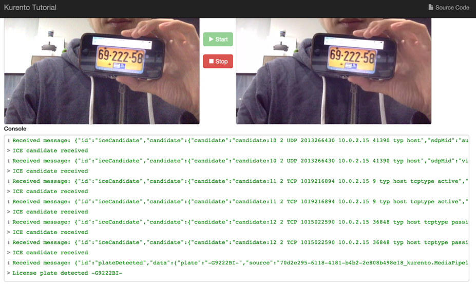
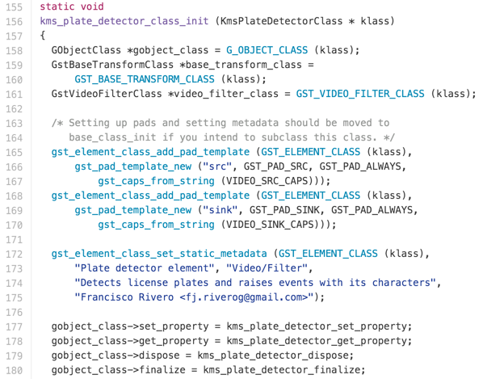

<!-- Cumstomzie image style: having border, horizontal center, white background -->

In <a href="https://www.swarmnyc.com" target="_blank">SWARM</a>, we use these comprehensive step-by-step guides to build a production-ready devops solution.

* [Setup Application Pipeline](#application-pipeline-setup-overview)

* [Setup WebApp Pipeline](#webapp-pipeline-setup)

# Application Pipeline Setup (Overview)

1. [ECR Repositories](#ecr-repositories-setup)

	Create ECS Repositories first, where the Dev team could build and push the application’s Docker image.

2. [Target Groups](#target-groups-setup)
	
	Target Groups are referenced by Load Balancer. Let’s create them before doing Load Balancer.

3. [Load Balancer](#load-balancer-setup)
	
	After a Load Balancer is created, you will get a DNS name(A Record) of it. Point all your site domain name to this DNS name.
	

4. [ECS Cluster](#ecs-cluster-setup)
	ECS Cluster is a container, where we can create Task Definitions and Services. An EC2 instance will also be created automatically while creating the ECS Cluster.

5. [ECS Task Definitions](#ecs-task-definitions-setup)

	Specify which Docker image should be used, how much CPU and memory to use, whether should the console logging message redirect to CloudWatch.

6. [ECS Services](#ecs-services-setup)

	Specify how many tasks should be run, which Task Definition should be use, which Target Group as well as Load Balancer should be register to.

7. [EC2 instance](#ec2-instance-setup)

	EC2 instance are created within ECS Cluster. We need to add an Inbound rule letting the Load Balancer redirect requests to.

# Pipeline Components Setup (Detail Operations)

## Target Groups setup

1. AWS console ⇒ EC2:

	

2. Target Groups ⇒ Create target group

	

3. Create 2 groups

	* Ludlow2-api-qa
	* Ludlow2-api-prod

	The port doesn’t matter, keep it as default: 80.

	VPC: pick one, make sure it is the same as the one in your Load Balancer and EC2 Instance.

	

4. After the target group created, double check tab "Health checks", and make sure your server will return a code within “Success codes” on the path “/”.

	

## Load Balancer setup

1. AWS console ⇒ EC2 ⇒ Load Balancers ⇒ Create Load Balancer

	 

2. Select: Application Load Balancer

	

3. Add 2 Listeners: HTTP / HTTPS, Select All Availability Zones.

	

4. Choose a certificate

	

5. Select an existing security group: default

	

6. New target group or Select existing one: Ludlow2-api-prod. Port doesn’t matter, keep it as default: 80.

	

7. No need to Register Targets, which will be register automatically by our ECS Services.

	

8. Review and Create

	

9. Select the new created Load Balancer: Ludlow2 ⇒ Listeners: 80/443 ⇒ View/edit rules

	

10. Add a rule: If Host is qa.ludlow.io forward to Target Group: Ludlow2-api-qa

	

## EC2 Instance setup

The EC2 instance where we need to add an inbound rule letting a Load Balancer redirect the request, should be created while creating ECS Cluster below.

1. AWS console ⇒ EC2 ⇒ Instances ⇒ Ludlow2 ⇒ click Security groups

	

2. Inbound ⇒ Edit

	

3. Add Rule, Type pick All TCP, Source input the Security Group ID(sg-964aa2ef) from Load Balancer: Ludlow2

	   

## ECS Cluster setup

1. AWS console ⇒ Elastic Container Service:

	

2. Clusters ⇒ Create Cluster

	

3. Select EC2 Linux + Networking

	

4. Use default EC2 instance.

	

5. Networking use existing VPC, Subnet, and Security group. Security group should be the same as the one in Load Balancer, i.e. default.

	

## ECR Repositories setup

1. AWS console ⇒ Elastic Container Service ⇒ Repositories ⇒ Create repository

	

2. Create two repositories: ludlow2-api-qa, ludlow2-api-prod.

	

3. Write down the commands, which will be used in CI platform: TeamCity.

	

## ECS Task Definitions setup

1. AWS console ⇒ Elastic Container Service ⇒ Task Definitions ⇒ Create new Task Definition

	

2. Select EC2 as launch type compatibility

	

3. Configure task and container definitions

	

4. Add container

	

5. Standard configuration:

	* Image points to the Repository we just created: ludlow2-api-qa

	* Memory Limits should set to Hard limit for qa, just in case of affecting the prod Task’s memory

	* Port mappings: Host port must be set to 0, in order to register to a Target Group with a dynamic port, which allow two different Tasks([Blue/Green Deployment](https://docs.cloudfoundry.org/devguide/deploy-apps/blue-green.html)) running at the same time, one for old version image, one for new version image. Container port is whatever you set in application’s Dockerfile.

	

6. Advanced container configuration

	* STORAGE AND LOGGING ⇒ Log configuration ⇒ check Auto-configure CloudWatch Logs, this makes sure all the console log will go to CloudWatch.

	

## ECS Services setup

1. AWS console ⇒ Elastic Container Service ⇒ Clusters ⇒ Ludlow2

	

2.  Services ⇒ Create

	

3. Configure services

	

	* Make sure Maximum percent * Number of tasks >= Number of tasks + 1, letting your new task can be started while the old one is stopping.

4. Configure network

	* Load balancer type: Application Load Balancer

	

	* Select Load Balancer: Ludlow2, Click Add to load balancer

	

	* Target group name, pick Ludlow2-api-qa

	

# WebApp Pipeline Setup

## S3 Bucket setup

1. AWS console ⇒ S3:

	

2. Create bucket

	

3. Name and region: put a name, e.g. ludlow-frontend

	

4. Take the default settings and Create bucket

	

## CloudFront setup

1. AWS console ⇒ CloudFront:

	

2. Create Distribution

	

3. Pick Web as the delivery method

	

4. Origin Settings: 

	* pick the S3 Bucket just created. E.g. ludlow-frontend.s3.amazonaws.com

	

5. Default Cache Behavior Settings:

	* Viewer Protocol Policy: Redirect HTTP to HTTPS

	

6. Distribution Settings

	* Alternate Domain Names(CNAMEs): your app’s url. E.g. app.ludlow.io

	* SSL Certificate: check Custom SSL Certificate, and pick the certificate to your app.

	* Others: keep them as are.

	

7. Click Create Distribution and you’re all set.

	

8. After the Distribution is created, you can have its Domain Name: d19daj4piv5qj9.cloudfront.net.

	

9.  You must create a CNAME record with your DNS service to route queries for api.ludlow.io to d19daj4piv5qj9.cloudfront.net

	

